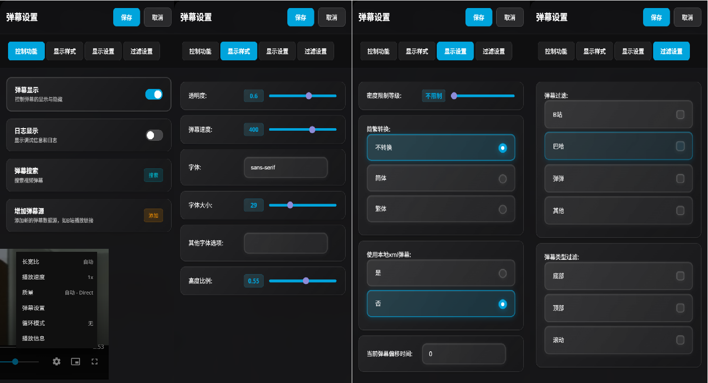

# jellyfin-danmaku

## Jellyfin弹幕插件

## 🎨 新版界面美化更新 (2025年8月)

**最新版本进行了全面的界面美化与功能优化：**

- **🎨 界面美化**：整体UI风格与配色已与Jellyfin默认主题保持一致
- **🚫 发送弹幕功能暂时隐藏**：发送弹幕功能暂不可用，相关按钮已隐藏
- **📱 一级界面简化**：播放界面仅保留弹幕开关按钮，界面更加简洁
- **⚙️ 设置界面重新设计**：其余弹幕设置功能移入 "设置" → "弹幕设置"
- **📋 侧边栏交互**：弹幕设置采用侧边栏弹出方式，操作更直观便捷

### 新设置界面截图



---


## 界面说明

> 请注意README上方截图可能与最新版存在差异，请以实际版本与说明为准

### 播放界面 (简化版)

播放界面左下方仅保留**弹幕开关**按钮：
- **弹幕开关**: 切换弹幕显示/隐藏状态

### 弹幕设置 (侧边栏)

通过 "设置" → "弹幕设置" 进入侧边栏设置界面，包含以下功能：

- **搜索弹幕**: 手动输入信息匹配弹幕
- **增加弹幕源**: 手动添加自定义弹幕源（用于番剧刚发布，弹弹Play还未收录弹幕源地址时使用，如果已经登录，则会提交给弹弹Play）
- **弹幕设置**:
  - 设置弹幕透明度 [0, 1]
  - 设置弹幕速度 [20, 600]
  - 设置弹幕字体大小 [8, 80]
  - 设置弹幕区域占屏幕的高度比例 [0, 1]
  - 弹幕密度: 依据水平和垂直密度过滤, 弹幕0级无限制*
  - 设置弹幕用户名过滤,支持选项: 哔哩哔哩, 巴哈姆特, 弹弹Play, 其他
  - 设置弹幕类型过滤,支持：底部，顶部，滚动
  - 简繁转换: 在原始弹幕/简体中文/繁体中文3种模式切换
  - 是否使用本地XML弹幕
  - 当前集数弹幕偏移时间
- **日志开关**: 开启/关闭调试日志输出
- ~~**发送弹幕**~~: *(暂时隐藏)* 登录弹弹Play，并在播放界面发送弹幕
- **自定义CORS代理和API接口**: 可使用自己搭建的cors代理；另外可以切换[l429609201/misaka_danmu_server](https://github.com/l429609201/misaka_danmu_server)替代弹弹Play（自定义API填入`http://<服务器IP>:<端口>/api/<你的Token>`）

 **除0级外均带有每3秒6条的垂直方向弹幕密度限制,高于该限制密度的顶部/底部弹幕将会被转为普通弹幕*

## 支持的客户端

- Jellyfin Web
- Jellyfin Android (播放器类型仅限网页播放器)
- Jellyfin iOS

## 弹幕

弹幕来源为 [弹弹 play](https://www.dandanplay.com/) ,已开启弹幕聚合(Acfun/Bili/Tucao/Baha/5DM/iQIYI等不知名网站弹幕融合)

**在启用了`使用本地xml弹幕`后，会尝试调用[cxfksword/jellyfin-plugin-danmu](https://github.com/cxfksword/jellyfin-plugin-danmu)的API获取其预先下载好的xml弹幕，绕过弹弹play的弹幕查询和加载**

## 数据

匹配完成后对应关系会保存在**浏览器(或客户端)本地存储**中,后续播放(包括同季的其他集)会优先按照保存的匹配记录载入弹幕

## 安装

任选以下一种方式安装即可，**方式1-3可以持久化。**

**注：** 安装完首次使用时，确保只有当前一个客户端访问服务器，以方便根据当前用户id获取Session时能唯一定位到当前客户端设备id。（主要是由于非Jellyfin Web客户端没有默认在localstorage中存储DeviceID）

**由于Cloudflare Pages被干扰，推荐使用以下任一地址替代原本的** ~~https://jellyfin-danmaku.pages.dev/ede.user.js~~

> https://cdn.jsdelivr.net/gh/Izumiko/jellyfin-danmaku@gh-pages/ede.user.js   
> https://jellyfin-danmaku.930524.xyz/ede.user.js   
> https://jellyfin-danmaku.vercel.app/ede.user.js   


### 1. 浏览器插件 (推荐)

1. [安装Tampermonkey插件](https://www.tampermonkey.net/)

**注：** 首次安装完Tampermonkey插件后记得启动[开发者模式用于运行用户脚本](https://www.tampermonkey.net/faq.php#Q209)

2. [添加脚本](https://cdn.jsdelivr.net/gh/Izumiko/jellyfin-danmaku@gh-pages/ede.user.js)

### 2. 反向代理处理 (推荐)

#### 2.1 Nginx

使用Nginx反向代理`Jellyfin`并在`location`块中插入:

```conf
proxy_set_header Accept-Encoding "";
sub_filter '</body>' '<script src="https://cdn.jsdelivr.net/gh/Izumiko/jellyfin-danmaku@gh-pages/ede.user.js" defer></script></body>';
sub_filter_once on;
```

- [`完整示例`](https://github.com/Izumiko/jellyfin-danmaku/issues/8)

#### 2.2 Caddy (`caddy2-filter` 插件)

下载Caddy二进制文件时，增加第三方模块[`sjtug/caddy2-filter`](https://github.com/sjtug/caddy2-filter)，之后，在`Caddyfile`中按如下内容修改

```Caddyfile
# 全局设置
{
    order filter after encode
}

# 网站设置
example.com {
    filter {
        path /web/.*
        search_pattern </body>
        replacement "<script src=\"https://cdn.jsdelivr.net/gh/Izumiko/jellyfin-danmaku@gh-pages/ede.user.js\" defer></script></body>"
        content_type text/html
    }
    reverse_proxy localhost:8096 {
        header_up Accept-Encoding identity
    }
}
```

#### 2.3 Caddy (`replace_response` 插件)

下载Caddy二进制文件时，增加模块[`caddyserver/replace-response`](https://github.com/caddyserver/replace-response)，之后，在`Caddyfile`中按如下内容修改

```Caddyfile
# 网站设置
example.com {
    replace /web/* {
        match {
            header Content-Type text/html*
        }
        "</body>" "<script src=\"https://cdn.jsdelivr.net/gh/Izumiko/jellyfin-danmaku@gh-pages/ede.user.js\" defer></script></body>"
    }
    reverse_proxy localhost:8096 {
        header_up Accept-Encoding identity
    }
}
```

### 3. 修改服务端启动命令

[思路来源](https://github.com/Izumiko/jellyfin-danmaku/issues/20)

**注**：修改镜像需要root权限，请勿更改容器的运行用户

#### 3.1 Docker模式启动的服务端

官方镜像的Entrypoint是`/jellyfin/jellyfin`，`hotio/jellyfin`镜像的Entrypoint是`/init`，可在`docker-compose.yml`的jellyfin部分增加一行如下代码，用带sed的Entrypoint替换默认的Entrypoint。

官方镜像：

```yaml
entrypoint: sh -c "sed -i 's#</div></body>#</div><script src=\"https://cdn.jsdelivr.net/gh/Izumiko/jellyfin-danmaku@gh-pages/ede.user.js\" defer></script></body>#' /jellyfin/jellyfin-web/index.html && exec /jellyfin/jellyfin"
```

`hotio/jellyfin`镜像：

```yaml
entrypoint: sh -c "sed -i 's#</div></body>#</div><script src=\"https://cdn.jsdelivr.net/gh/Izumiko/jellyfin-danmaku@gh-pages/ede.user.js\" defer></script></body>#' /usr/share/jellyfin/web/index.html && exec /init"
```

#### 3.2 直接用包管理器安装，并使用systemd管理的服务端

部分用户使用deb包或者Arch Linux的aur包安装Jellyfin，可以修改systemd service文件来实现启动时追加js脚本。
运行`systemctl edit jellyfin.service`，进入编辑界面，然后输入如下内容：

deb包安装的版本：

```ini
[Service]
ExecStartPre=-/usr/bin/sed -i 's#</div></body>#</div><script src="https://cdn.jsdelivr.net/gh/Izumiko/jellyfin-danmaku@gh-pages/ede.user.js" defer></script></body>#' /usr/share/jellyfin/web/index.html
```

aur安装的版本：

```ini
[Service]
ExecStartPre=-/usr/bin/sed -i 's#</div></body>#</div><script src="https://cdn.jsdelivr.net/gh/Izumiko/jellyfin-danmaku@gh-pages/ede.user.js" defer></script></body>#' /usr/lib/jellyfin/jellyfin-web/index.html
```

保存后，运行`systemctl daemon-reload`生效，`systemctl restart jellyfin`重启当前服务。

### 4. 修改服务端

**可使用[@yomunsam](https://github.com/yomunsam)提供的自动化修改插件[yomunsam/Jellyfin.WebDanmakuStarter](https://github.com/yomunsam/Jellyfin.WebDanmakuStarter)，或者按照下面的方法手动修改。**

修改文件 `/usr/share/jellyfin/web/index.html`
*(Default)*

或 `/jellyfin/jellyfin-web/index.html`
*(Official Docker)*

**在`</body>`前添加如下标签**

```html
<script src="https://cdn.jsdelivr.net/gh/Izumiko/jellyfin-danmaku@gh-pages/ede.user.js" defer></script>
```

**Shell中的操作命令为：**

*Official Docker:*

```bash
sed -i 's#</body>#<script src="https://cdn.jsdelivr.net/gh/Izumiko/jellyfin-danmaku@gh-pages/ede.user.js" defer></script></body>#' /jellyfin/jellyfin-web/index.html
```

*Default:*

```bash
sed -i 's#</body>#<script src="https://cdn.jsdelivr.net/gh/Izumiko/jellyfin-danmaku@gh-pages/ede.user.js" defer></script></body>#' /usr/share/jellyfin/web/index.html
```

该方式安装与浏览器插件安装**可同时使用不冲突**

## 常见弹幕加载错误/失败原因

1. 译名导致的异常: 如『よふかしのうた』 Emby 识别为《彻夜之歌》后因为弹弹 play 中为《夜曲》导致无法匹配
2. 存在多季/剧场版/OVA 等导致的异常: 如『OVERLORD』第四季若使用S[N]格式归档(如OVERLORD/S4E1.mkv或OVERLORD/S4/E1.mkv),可能出现匹配失败/错误等现象
3. 其他加载BUG: ~~鉴定为后端程序猿不会前端还要硬写JS~~,有BUG麻烦 [开个issue](https://github.com/Izumiko/jellyfin-danmaku/issues/new/choose) THX
4. 使用l429609201/misaka_danmu_server且通过https访问Jellyfin时，需要反代misaka_danmu_server并自行处理CORS问题。

> 首次播放时请检查当前弹幕信息是否正确匹配,若匹配错误请尝试手动匹配


[](https://starchart.cc/Izumiko/jellyfin-danmaku)
